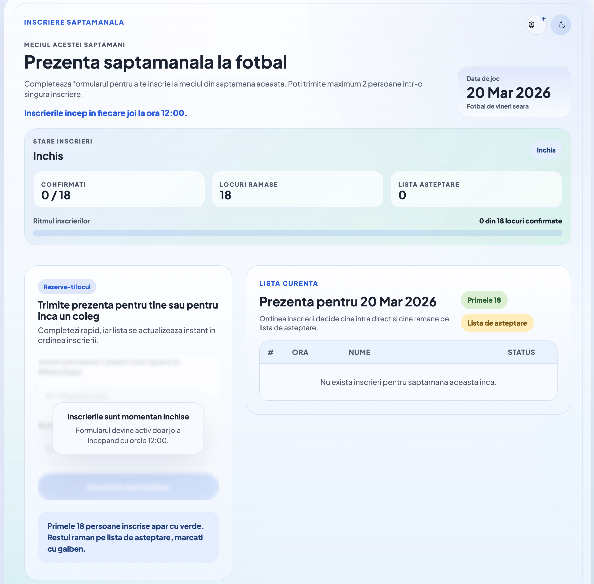

# Football Attendance

Weekly football attendance app with a public signup page, admin controls, and a dedicated team-builder view for creating 3 balanced teams from the first 18 confirmed players.

## Preview



## What It Does

- public weekly signup form with up to 2 names per submission
- automatic Friday-based week label
- first 18 players marked as confirmed
- extra players placed on the waiting list
- admin login protected by `ADMIN_PASSWORD`
- admin tools to:
  - force the form open, closed, or automatic
  - delete one registration
  - clear the current week
  - clear all historical registrations
- dedicated `/echipe` page for:
  - assigning each confirmed player a preferred role
  - generating 3 balanced teams
  - resetting generated teams

## Main Routes

- `/` - public attendance page
- `/echipe` - team builder page
- `/teams` - alias for the team builder page

## Tech Stack

- Python standard-library HTTP server
- PostgreSQL in production through `DATABASE_URL`
- SQLite fallback for local development
- plain HTML, CSS, and JavaScript on the frontend

## Local Development

```bash
python3 -m venv .venv
source .venv/bin/activate
pip install -r requirements.txt
export ADMIN_PASSWORD="test123"
python3 server.py
```

Then open:

- [http://localhost:8000](http://localhost:8000)
- [http://localhost:8000/echipe](http://localhost:8000/echipe)

## Environment Variables

- `ADMIN_PASSWORD`
  Enables admin access and signs the admin session cookie.

- `DATABASE_URL`
  If set, the app uses PostgreSQL.

- `HOST`
  Defaults to `0.0.0.0`.

- `PORT`
  Defaults to `8000`.

## Admin Features

After setting `ADMIN_PASSWORD`, the admin panel becomes available in the UI.

Attendance page admin actions:

- force signup open
- force signup closed
- switch back to automatic window handling
- delete one row
- clear the current week
- clear all weeks

Team-builder page admin actions:

- log in using the same admin session
- assign a role for each confirmed player:
  - `Atac`
  - `Mijloc`
  - `Aparare`
  - `Oriunde`
- generate 3 balanced teams
- reset generated teams

## Signup Rules

In automatic mode:

- signup opens every Thursday at `11:59`
- signup closes every Friday at `23:59`
- outside that window the form is locked

Admin can override this with:

- `force_open`
- `force_closed`
- `auto`

## Data Model

Registrations store:

- submitted name
- creation timestamp
- ISO week key
- preferred role
- generated team assignment

App settings store:

- current signup mode

## Deployment

This repo includes [render.yaml](render.yaml), so the simplest deployment path is Render.

High-level flow:

1. Push the repo to GitHub.
2. Create a new Render Blueprint service.
3. Select this repository.
4. Let Render provision the app and PostgreSQL database.
5. Add `ADMIN_PASSWORD` in the Render environment.

## Tests

Backend coverage includes:

- signup window logic
- registration validation
- registration ordering
- admin authentication
- delete / clear actions
- role assignment
- team generation
- team reset

Frontend coverage includes:

- initial dashboard rendering
- signup form behavior
- locked state behavior
- team-builder rendering
- team generation refresh behavior

Run everything:

```bash
python3 -Wd -m unittest discover -s tests -v
node --test tests/test_frontend.js
```

Additional quick checks:

```bash
python3 -m py_compile server.py
node --check static/app.js
node --check static/teams.js
```

## Project Structure

- [server.py](server.py) - API, storage, admin logic, routing
- [static/index.html](static/index.html) - main attendance page
- [static/app.js](static/app.js) - main page behavior
- [static/teams.html](static/teams.html) - dedicated team-builder page
- [static/teams.js](static/teams.js) - team-builder interactions
- [static/styles.css](static/styles.css) - shared styling
- [tests/test_server.py](tests/test_server.py) - backend integration tests
- [tests/test_frontend.js](tests/test_frontend.js) - frontend script tests
- [tests/frontend_harness.js](tests/frontend_harness.js) - fake DOM test harness
- [render.yaml](render.yaml) - Render deployment config

## Notes

- local development uses SQLite unless `DATABASE_URL` is provided
- production should use PostgreSQL
- free hosting can still have sleeping services or temporary limitations depending on the platform
