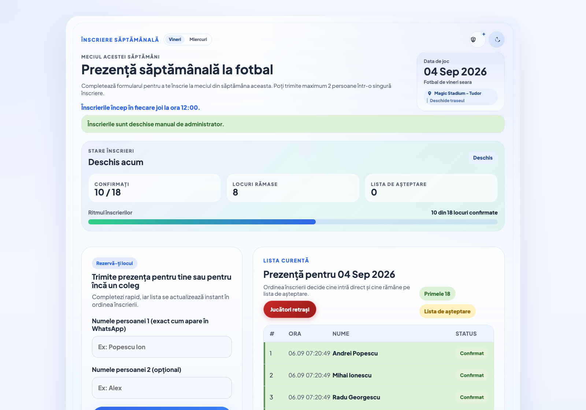

# Football Attendance

Weekly football attendance app with separate Friday and Wednesday signup lists, admin controls, and a dedicated Friday team-builder view for creating 3 balanced teams from the first 18 confirmed players.

## Preview



## What It Does

- public weekly signup form with up to 2 names per submission
- separate public lists and automatic match dates for Friday and Wednesday
- event-specific venue links that open the correct destination in Google Maps
- distinct blue Friday and green pitch-inspired Wednesday visual themes
- live countdown to the next opening or current closing time
- adaptive layout that prioritizes signup while open and the roster while closed
- detailed confirmation showing each submitted player's position and status
- installable PWA shell with offline UI and last-known-list fallback
- keyboard, reduced-motion, forced-color, and screen-reader accessibility support
- first 18 players marked as confirmed
- extra players placed on the waiting list
- admin login protected by `ADMIN_PASSWORD`
- admin tools to:
  - force the form open, closed, or automatic
  - delete one registration
  - clear the current week
  - clear all historical registrations
- dedicated `/echipe` page for:
  - assigning each confirmed player a preferred role
  - generating 3 balanced teams
  - resetting generated teams

## Main Routes

- `/` - Friday attendance page
- `/miercuri` - Wednesday attendance page
- `/wednesday` - alias for the Wednesday attendance page
- `/echipe` - team builder page
- `/teams` - alias for the team builder page

## Tech Stack

- Python standard-library HTTP server
- PostgreSQL in production through `DATABASE_URL`
- SQLite fallback for local development
- plain HTML, CSS, and JavaScript on the frontend

## Local Development

```bash
python3 -m venv .venv
source .venv/bin/activate
pip install -r requirements.txt
export ADMIN_PASSWORD="test123"
python3 server.py
```

Then open:

- [http://localhost:8000](http://localhost:8000)
- [http://localhost:8000/miercuri](http://localhost:8000/miercuri)
- [http://localhost:8000/echipe](http://localhost:8000/echipe)

## Environment Variables

- `ADMIN_PASSWORD`
  Enables admin access and signs the admin session cookie.

- `DATABASE_URL`
  If set, the app uses PostgreSQL.

- `HOST`
  Defaults to `0.0.0.0`.

- `PORT`
  Defaults to `8000`.

## Admin Features

After setting `ADMIN_PASSWORD`, the admin panel becomes available in the UI.

Attendance page admin actions are scoped to the selected Friday or Wednesday event:

- force signup open
- force signup closed
- switch back to automatic window handling
- delete one row
- clear the current week
- clear all weeks for that event

Team-builder page admin actions:

- log in using the same admin session
- assign a role for each confirmed player:
  - `Atac`
  - `Mijloc`
  - `Apărare`
  - `Oriunde`
- generate 3 balanced teams
- reset generated teams

## Signup Rules

Friday automatic mode:

- signup opens every Thursday at `11:59`
- signup closes every Friday at `23:59`

Wednesday automatic mode:

- signup opens every Monday at `19:30`
- signup closes Wednesday at `19:30`, when the `19:30-21:30` match starts
- Wednesday registrations are removed on Sunday
- if Render sleeps through Sunday, cleanup runs before the first request in the new week

Outside each event's window, its form is locked. Friday and Wednesday admin overrides are stored independently.

Admin can override this with:

- `force_open`
- `force_closed`
- `auto`

## Data Model

Registrations store:

- submitted name
- creation timestamp
- ISO week key
- event key (`friday` or `wednesday`)
- preferred role
- generated team assignment

App settings store:

- Friday signup mode
- Wednesday signup mode

## Deployment

This repo includes [render.yaml](render.yaml), so the simplest deployment path is Render.

High-level flow:

1. Push the repo to GitHub.
2. Create a new Render Blueprint service.
3. Select this repository.
4. Let Render provision the app and PostgreSQL database.
5. Add `ADMIN_PASSWORD` in the Render environment.

## Tests

Backend coverage includes:

- signup window logic
- Friday and Wednesday list isolation
- Sunday cleanup and Monday catch-up
- database migration of existing rows to Friday
- registration validation
- registration ordering
- admin authentication
- delete / clear actions
- role assignment
- team generation
- team reset

Frontend coverage includes:

- initial dashboard rendering
- signup form behavior
- detailed multi-player success feedback
- authoritative countdown rendering
- offline cached-list fallback
- Wednesday route copy and event-aware requests
- locked state behavior
- accessibility and responsive UI contracts
- manifest and service-worker app-shell validation
- team-builder rendering
- team generation refresh behavior

Run everything:

```bash
python3 -Wd -m unittest discover -s tests -v
node --test tests/test_frontend.js
```

Additional quick checks:

```bash
python3 -m py_compile server.py
node --check static/app.js
node --check static/teams.js
```

## Project Structure

- [server.py](server.py) - API, storage, admin logic, routing
- [static/index.html](static/index.html) - main attendance page
- [static/app.js](static/app.js) - main page behavior
- [static/teams.html](static/teams.html) - dedicated team-builder page
- [static/teams.js](static/teams.js) - team-builder interactions
- [static/styles.css](static/styles.css) - shared styling
- [static/ui-enhancements.css](static/ui-enhancements.css) - adaptive layout, accessibility, and interaction styling
- [static/manifest.webmanifest](static/manifest.webmanifest) - installable app metadata
- [static/service-worker.js](static/service-worker.js) - offline app-shell caching
- [tests/test_server.py](tests/test_server.py) - backend integration tests
- [tests/test_ui_contract.py](tests/test_ui_contract.py) - static accessibility, responsive, and PWA contracts
- [tests/test_frontend.js](tests/test_frontend.js) - frontend script tests
- [tests/frontend_harness.js](tests/frontend_harness.js) - fake DOM test harness
- [render.yaml](render.yaml) - Render deployment config

## Notes

- local development uses SQLite unless `DATABASE_URL` is provided
- production should use PostgreSQL
- free hosting can still have sleeping services or temporary limitations depending on the platform
